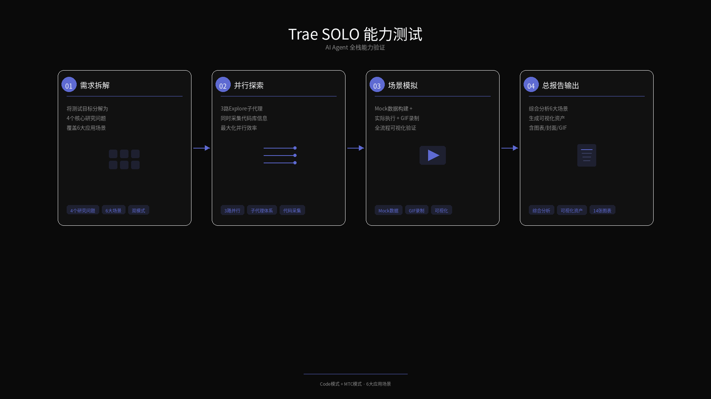
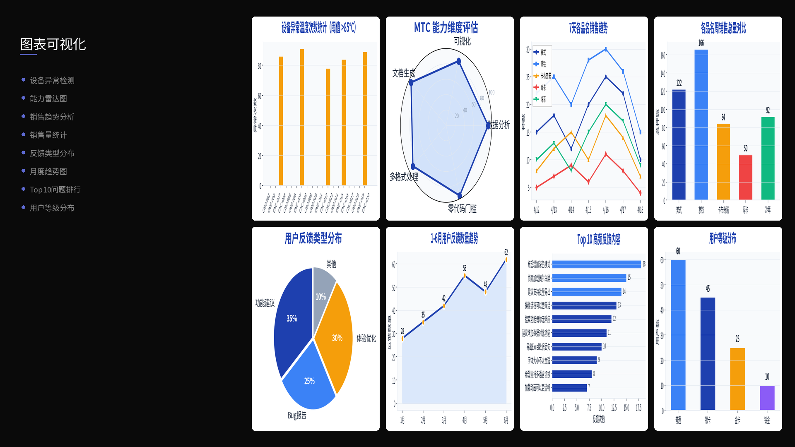
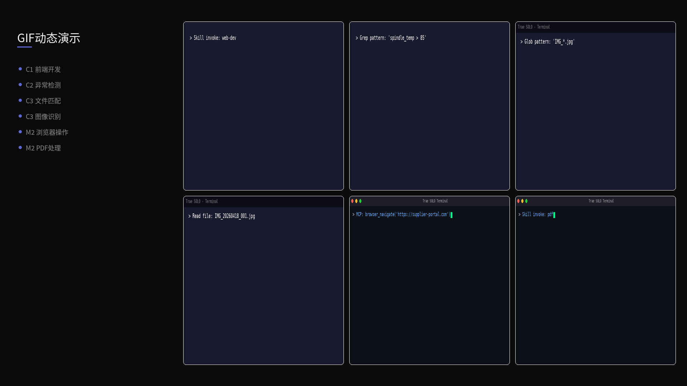
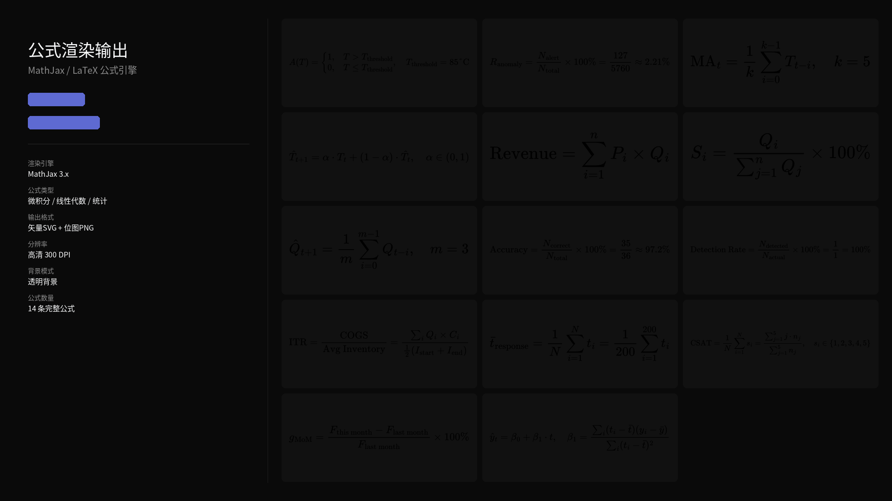
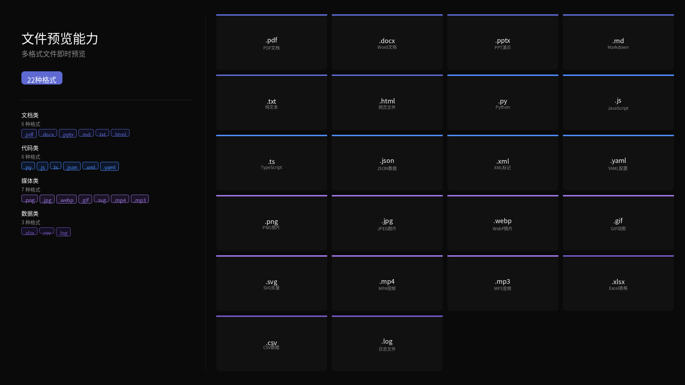

# Trae SOLO 能力测试

AI Agent 全栈能力验证 —— Code模式 + MTC模式，覆盖6大应用场景。

## 作品渲染

| PPT演示效果 | 图表可视化 | 动态演示 |
|:---:|:---:|:---:|
|  |  |  |

| 公式渲染输出 | 文件预览能力 |
|:---:|:---:|
|  |  |

## 工作流

1. **需求拆解** — 4个研究问题 × 6大应用场景
2. **并行探索** — 3路Explore子代理同时采集
3. **场景模拟** — mock数据构造 + 实际执行 + GIF录制
4. **总报告输出** — 综合分析报告 + 可视化资产

## 技术栈

`Trae SOLO` `Code模式` `MTC模式` `Pillow` `PptxGenJS` `MathJax`
