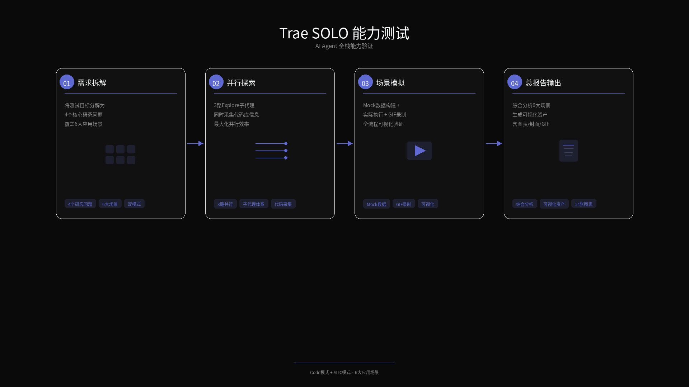
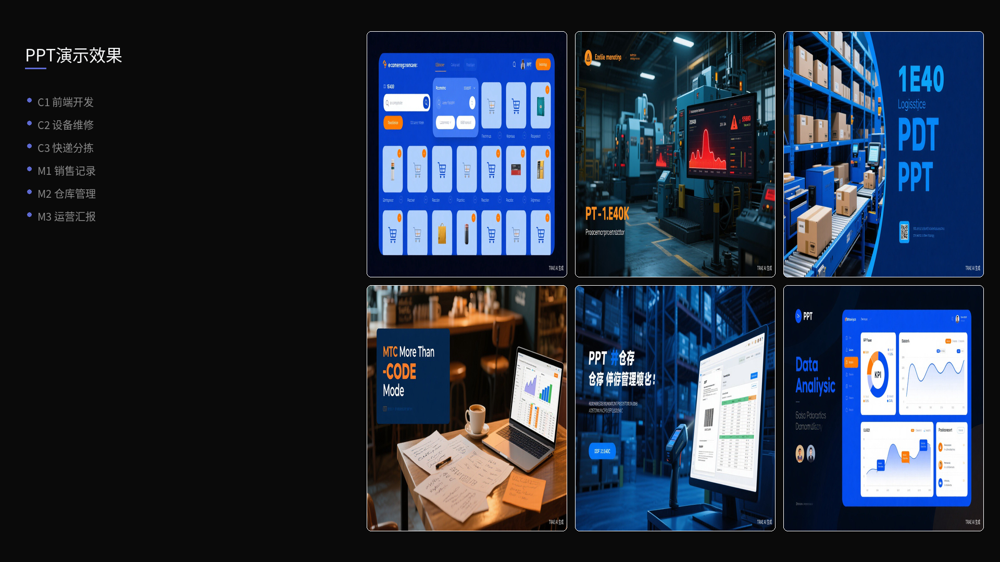
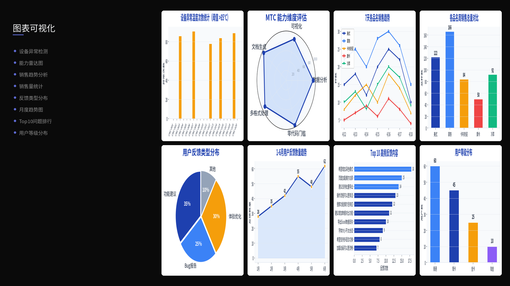
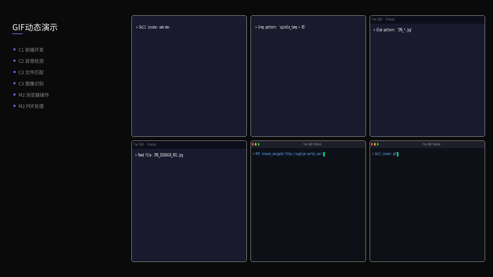
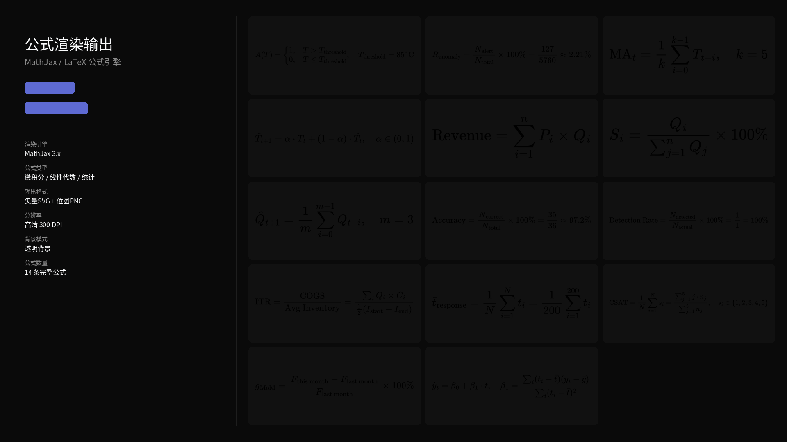
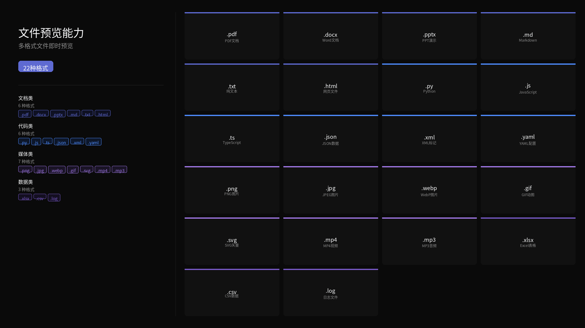

# Trae SOLO 能力测试

记录 Trae SOLO 在 Code / MTC 模式下处理六类模拟任务的探索过程与展示产物。适合希望了解既有场景、工具流程、文件预览与多格式输出的读者。

## 从哪里开始

- [总报告](outputs/00_Trae_SOLO能力测试总报告.md)：整体探索入口。
- [模式与场景分析](outputs/Q1_模式与场景分析.md)、[子代理体系](outputs/Q2_子代理体系.md) 与 [工具清单](outputs/Q3_工具清单.md)：逐项阅读既有记录。
- [文件预览测试报告](outputs/Q4_文件预览测试/预览测试报告.md)：查看已保存的格式样例与记录。
- [演示 PPT](outputs/ppt_assets/ppt_output/) 与 [图表](outputs/ppt_assets/charts/)：下载展示产物；[开发说明](README_DEV.md) 保留六场景清单和后续方向。

## 获取与状态

可通过 Code 页面阅读 Markdown，或下载对应 PPT、图片及仓库副本。当前树没有根目录应用入口或统一依赖清单，因此不提供猜测的安装/启动命令。

场景输入在既有文档中标为 mock/模拟数据；展示与评分属于制作时的探索记录，不能推广为当前版本的通用性能基准。本次未运行场景脚本、重新测试预览能力或读取模拟数据；既有开发说明中的 `project_context/` 在当前文件树未出现，以实际目录为准。

## 既有探索展示

AI Agent 全栈能力验证 —— Code模式 + MTC模式，覆盖6大应用场景。

## 作品渲染

| PPT演示效果 | 图表可视化 | 动态演示 |
|:---:|:---:|:---:|
|  |  |  |

| 公式渲染输出 | 文件预览能力 |
|:---:|:---:|
|  |  |

## 工作流

1. **需求拆解** — 4个研究问题 × 6大应用场景
2. **并行探索** — 3路Explore子代理同时采集
3. **场景模拟** — mock数据构造 + 实际执行 + GIF录制
4. **总报告输出** — 综合分析报告 + 可视化资产

## 技术栈

`Trae SOLO` `Code模式` `MTC模式` `Pillow` `PptxGenJS` `MathJax`

## 贡献与维护

欢迎通过本仓库 Issue 或 Pull Request 补充可复现步骤、纠正文档或说明兼容问题；请附环境、操作步骤和预期结果，并保留原作者与引用来源。

文档与导航维护：[Ming-Sir-69](https://github.com/Ming-Sir-69)。此署名只标识仓库维护，不改变项目、资料或第三方组件的权属。

## 许可

当前文件树未发现 LICENSE 或 NOTICE。此 README 的维护署名不新增开源、商用或资料再分发授权；具体授权范围待维护者确认。
